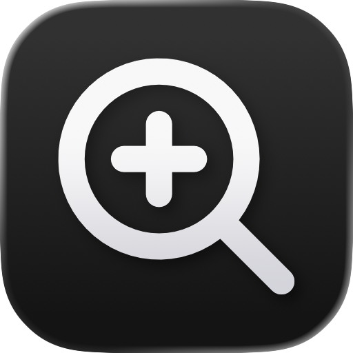
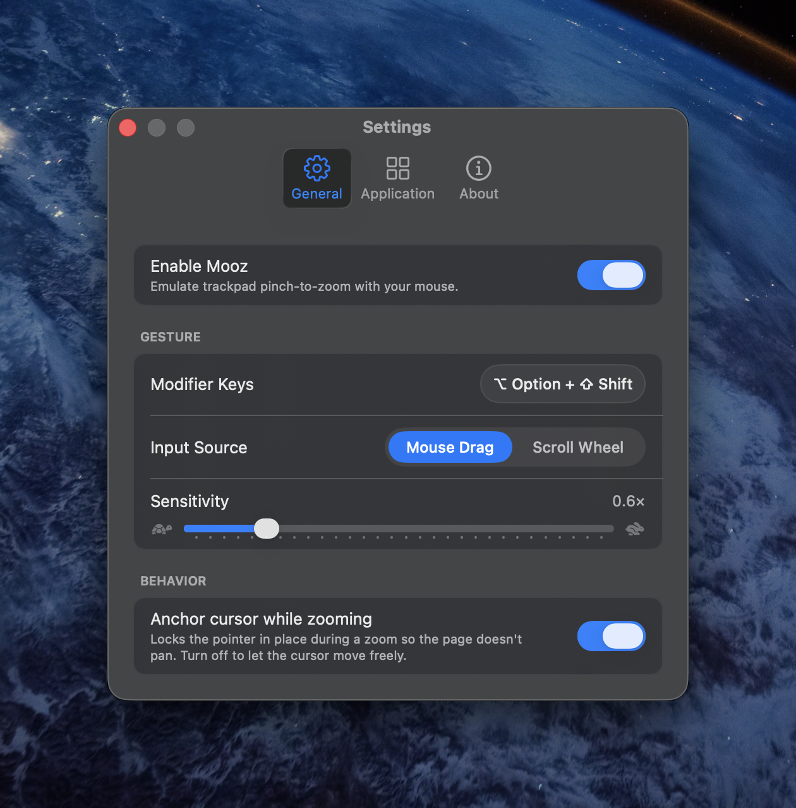

<div align="center">

<picture>
  <source media="(prefers-color-scheme: dark)" srcset="design/icon/exports/default.png">
  
</picture>

# Mooz

**Trackpad pinch-to-zoom for any mouse, on macOS.**

[](https://github.com/Dananz/mooz/releases/latest)
[](https://github.com/Dananz/mooz/releases/latest/download/Mooz.dmg)
[](LICENSE)
[](https://www.apple.com/macos/)

[Website](https://dananz.github.io/mooz/) &middot; [Download](https://github.com/Dananz/mooz/releases/latest/download/Mooz.dmg) &middot; [Releases](https://github.com/Dananz/mooz/releases)

</div>

Mooz is a tiny macOS menu-bar app that lets a regular mouse do the one thing only a trackpad could: smooth, continuous pinch-to-zoom inside any app. Hold a modifier key and move the mouse (or scroll), and Mooz synthesizes a real macOS magnify gesture, so the view zooms exactly like it would from a trackpad in Safari, Chrome, Firefox, Zen, Preview, Maps, anywhere the system pinch gesture works. Built in Swift 6 and SwiftUI. No Dock icon, no clutter.

> **Why "Mooz"?** It's *zoom* spelled backwards, and it reads a little like *mouse*. The whole app is about pointing your mouse at the one trackpad trick it never had.

## Screenshots

<div align="center">

<br><sub>Pick the modifier, drag or scroll, set sensitivity, and toggle cursor anchoring.</sub>
</div>

## Features

### Native pinch-zoom
- Synthesizes a real macOS magnify gesture, so apps zoom like they do from a trackpad, not a `⌘ +/-` shortcut hack.
- Works everywhere, including Gecko browsers (Firefox / Zen) that need a fully-formed gesture event most tools don't produce.

### Trigger and input
- Record any modifier or combo (⇧, ⌘, ⌃, ⌥, or e.g. ⇧⌘) as the trigger.
- Choose **Mouse Drag** or **Scroll Wheel** as the input source.
- Adjustable **sensitivity** with smoothing for a natural feel.

### Cursor anchoring
- The pointer stays pinned where the zoom starts, so content doesn't pan out from under you. Turn it off to let the cursor move freely.

### Per-app control
- A blocklist or allowlist, so Mooz only acts in the apps you choose.

### Menu-bar app
- Lives in the menu bar (no Dock icon), with a glass, tabbed Settings window.

### Auto-update
- In-app updates via [Sparkle](https://sparkle-project.org): a "Check for Updates" item in the menu and a Software Update section in Settings, plus daily background checks.

## Install

Download the latest **`Mooz.dmg`** from the [releases page](https://github.com/Dananz/mooz/releases/latest), open it, and drag **Mooz** into Applications.

### First launch
- Grant **Accessibility** permission when prompted (System Settings → Privacy & Security → Accessibility → enable Mooz). It is required to read input and post the gesture.
- If macOS says it cannot verify the developer, allow Mooz under System Settings → Privacy & Security → **Open Anyway** (or right-click the app and choose **Open**).

### Requirements
- macOS 14 or later.

## Usage

1. Hold your **modifier** (default **⇧ Shift**) and **drag** up to zoom in, down to zoom out, or switch the input to **Scroll Wheel** in Settings.
2. Release to stop. The pointer stays anchored unless you turn anchoring off.
3. Tune the **modifier**, **input source**, **sensitivity**, and **anchoring** in **Settings → General**, and set per-app rules in **Settings → Application**.

## Build from source

### Prerequisites
- macOS 14+, [Xcode](https://developer.apple.com/xcode/) 16+.
- [XcodeGen](https://github.com/yonaskolb/XcodeGen) (`brew install xcodegen`); the Xcode project is generated from `project.yml`.

### Run
```bash
xcodegen generate
open Mooz.xcodeproj          # then press Run, or:
xcodebuild -scheme Mooz -configuration Debug build
```

### Releasing
The version is single-sourced from the repo-root `VERSION` file. It drives the app (`MARKETING_VERSION`), the website (read at build time), and the release tag; `scripts/check-version.sh` guards against drift in CI. One command cuts a signed, notarized release:

```bash
scripts/release.sh 1.1.0     # or no argument to release the current VERSION
```

It builds Release, deep-signs the app and the embedded Sparkle helpers with Developer ID, notarizes and staples the DMG, regenerates the appcast, tags `v<VERSION>`, and creates the GitHub release with `Mooz.dmg` attached. One-time setup (Developer ID cert, a `notarytool` keychain profile, a Sparkle EdDSA key, and an authenticated `gh`) is required; **back up the Sparkle private key**, since losing it stops auto-updates for existing users.

## Tech stack

Swift 6 and SwiftUI, low-level event taps to read the trigger and synthesize the native pinch gesture (with a small C/Objective-C core), [Sparkle](https://sparkle-project.org) for auto-updates, and XcodeGen for the project. The marketing site is Next.js (static export) deployed to GitHub Pages.

## Contributing

Issues and pull requests are welcome. Keep changes focused, and run `xcodegen generate` after editing `project.yml`.

## License

[MIT](LICENSE) © Tomer Danan. See [NOTICE](NOTICE) for third-party attributions.
